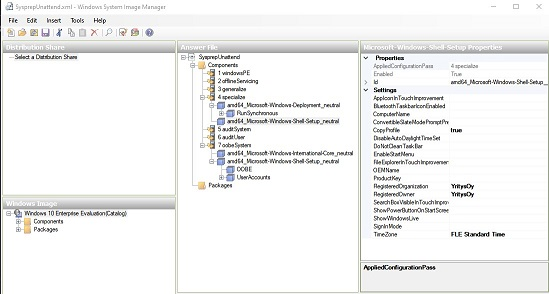

# Työaseman asennuksen automatisointi  

- [x] Tee itsellesi *Markdown* muotoinen ohje Windows työaseman asentamisesta siten että siitä voidaan ottaa levykuva talteen esim. *VirtualBoxin* export/vie toiminnon avulla.  
- [x] Kirjoita ohjeeseen käyttöönoton kaikki vaiheet siihen pisteeseen asti jossa työasema on valmis exportoitavaksi eli vietäväksi tiedostoon. Voit kirjata halutessasi ohjeeseen myös sen miten tämä toiminto tehdään VirtuaBox:a  
- [x] Kirjaa ohjeeseesi ainaki seuraavat asiat: 
* Miten päääset asennuksen aikana *Audit* tilaan
* Miten mukauttaisit ympäristöä ennen *sysprep* ohjelman ajamista.
* Mtien *Sysprep* ohjelmaa käytetään graafisen työkalun ja/tai komentokehotteen kautta
* Kuvaa vastausiedoston luomista yleisellä tasolla. Halutessasi voit kirjata mukaan myös asetukset esim. kuvaruutukaappauksin tai muulla tavalla.
* Miten vastaustiedostoa käyttö yhdessä *sysprep* ohjelman kanssa (vastaustiedoston sijainti valmisteltavassa työasemassa ja *sysprep* ohjelman parametrit.   

